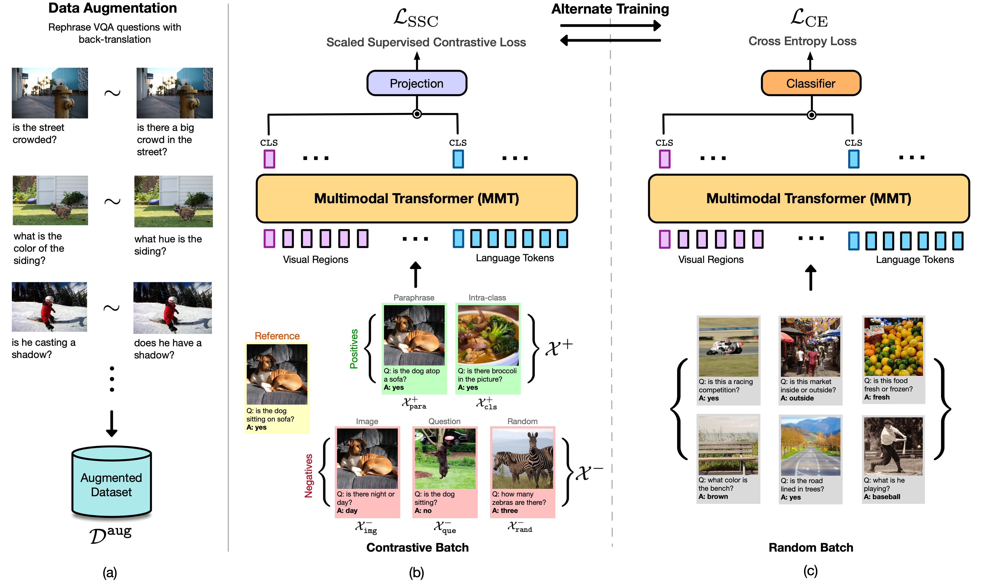

Contrast and Classify: Alternate Training for Robust VQA
===================================================
<h4>
Yash Kant, Abhinav Moudgil, Dhruv Batra, Devi Parikh, Harsh Agrawal
</br>
<span style="font-size: 14pt; color: #555555">
Pre-print, Under Review
</span>
</h4>
<hr>

**Paper:** [https://arxiv.org/abs/2010.06087](https://arxiv.org/abs/2010.06087)

**Project Page:** [yashkant.github.io/projects/concat-vqa](https://yashkant.github.io/projects/concat-vqa.html)

<p align="center">
  
</p>

We propose a novel training paradigm (ConCAT) that alternately optimizes cross-entropy and contrastive losses. The contrastive loss encourages representations to be robust to linguistic variations in questions while the cross-entropy loss preserves the discriminative power of the representations for answer classification. VQA models trained with ConCAT achieve higher consensus scores on the VQA-Rephrasings dataset as well as higher VQA accuracy on the VQA 2.0 dataset compared to existing approaches across a variety of data augmentation strategies.

## Repository Setup

Create a fresh conda environment and install all dependencies.

```text
conda create -n concat python=3.6
conda activate concat
cd code
pip install -r requirements.txt
```

Install PyTorch and CUDA tooklt.
```
conda install pytorch torchvision cudatoolkit=10.0 -c pytorch
```

## Data Setup
Check `README.md` under `data-release` for more details.  

## Training
We provide commands to run both the baseline and ConCAT experiments.

#### Baseline

To train the baseline experiment with only Cross Entropy on train set use:
```
python train.py \
--task_file configs/baseline-train.yml  \
--tag baseline-train \      # output folder
```
To train the baseline experiment with only Cross Entropy on train +val set use:
```
python train.py \
--task_file configs/baseline-trainval.yml  \
--tag baseline-trainval \      # output folder
```

#### ConCAT
To train with ConCAT alternate training on train set use:
```
python train.py \
--task_file configs/concat-train.yml  \
--tag concat-train \      # output folder
```
To train with ConCAT alternate training on train+val set use:
```
python train.py \
--task_file configs/concat-trainval.yml  \
--tag concat-trainval \      # output folder
```

## Result Files
We share result files from above runs which could be submitted to the EvalAI challenge server to obtain the results in the paper:
  
  Method  |  val   |  test-dev   |  test-std  |
 ------- | ------ | ------ | ------ |
Baseline (train)  | 66.31 | - | - |
ConCAT (train)  | **66.98** | - | - |
Baseline (trainval)  | - | 69.51 | 69.22 |
ConCAT (trainval)  | - | **69.80** | **70.00** |

These files are placed under `results/<experiment-name>`. 
